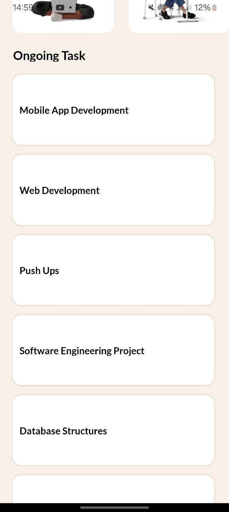
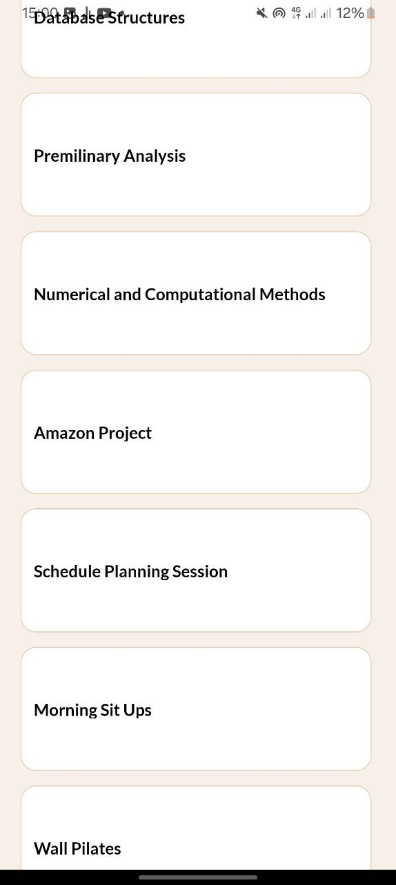
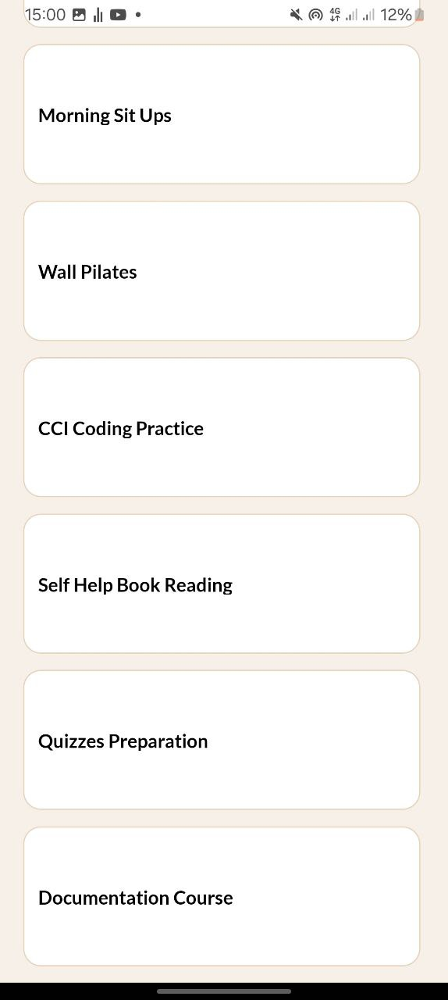

# Components Description
_In the App.js file:_
  ### From 'react-native' 

* **`SafeAreaView`** :
  - This is to ensure that the content is clearly rendered within the viewable area boundaries of a mobile device, specifically on iPhones.

* **`StyleSheet`**:
  - StyleSheet is for managing styles in this React Native application.

* **`Text`**:
  - This is for displaying text.

* **`View`**:
  - This is a container component for holding children components and representing them with style and layout properties.

* **`Image`**:
  - This component is for displaying images.

* **`TextInput`**:
  - This component allows users to enter or input text.

* **`ScrollView`**:
  - This component enables scrolling of its child components vertically or horizontally.

* **`FlatList`**:
  - This component or interface is for rendering simple, flat lists of items.

### Other components:
* **`Feather`** from `'@expo/vector-icons'`:
  - This component is a library for including Feather icons in the application. Those used in this application were the 'search' icon and the 'sliders' icon.

* **`React`** from `'react'`:
  - React is the core library for building UI (User Interfaces) in a declarative manner.

* **`AppLoading`** from `'expo-app-loading'`:
  - AppLoading is component used to show a loading screen while fetching or preparing app data. This was needed in enabling the use of the fonts.

* **`useFonts`, `Lato_400Regular`, `Lato_700Bold`** from `'@expo-google-fonts/lato'`:
  - These are hooks and font definitions for using Google Fonts. The fonts imported were Lato Regular with a weight of 400 and Lato Bold with a weight of 700, as specified in the provided UI Design.

### Custom Components

* **`HorizontalItem`**:
  - This functional componet represents an item in a horizontal list. It displays two different pieces of text and an image.

* **`HorizontalSection`**:
  - This functional component renders a section header and a horizontally scrollable list of items using `FlatList`.

* **`VerticalItem`**:
  - This functional component represents an item in a vertical list. It displays a single piece of text. 

* **`VerticalSection`**:
  - This functional component renders a section header and a vertically scrollable list of items using `FlatList`.

### Data

* **`HORIZONTAL`**:
  - This represented an array of objects for categories with tasks and images, to be displayed in a horizontal section.

* **`VERTICAL`**:
  - This representd an array of objects for ongoing tasks to be displayed in a vertical section.

## Screenshots

